```mermaid
erDiagram
    %% ========== کاربران و احراز هویت ==========
    User ||--o{ Post : "نویسنده"
    User ||--o{ Comment : "نویسنده کامنت"
    User ||--o| UserProfile : "دارد"
    User ||--o| Seller : "می‌تواند باشد"
    User }o--o{ Role : "دارد نقش‌ها"
    User ||--o| Cart : "دارد سبد خرید"
    User ||--o{ Order : "ثبت می‌کند"

    User {
        int id PK
        string email UK
        string password
        string name
        timestamp createdAt
        timestamp updatedAt
    }

    Role {
        int id PK
        string name UK "admin, seller, customer, user"
    }

    UserProfile ||--o{ Address : "دارد آدرس‌ها"

    UserProfile {
        int id PK
        int userId FK
        string bio
        string avatar
        string website
        string location
        string socialLinks
        string phone
        string alternativePhone
        text address "آدرس قدیمی - deprecated"
        string city
        string province
        string postalCode
        string nationalId
    }

    Address {
        int id PK
        int userProfileId FK
        string title "خانه، محل کار، ..."
        string recipientName
        string phone
        string alternativePhone
        text address
        string city
        string province
        string postalCode
        boolean isDefault
        timestamp createdAt
        timestamp updatedAt
    }

    %% ========== بلاگ ==========
    Post ||--o{ Comment : "دارد کامنت"
    Post }o--|| Category : "دارد دسته‌بندی"
    Post }o--o{ Tag : "دارد تگ‌ها"
    Post }o--|| File : "تصویر شاخص"
    Post }o--|| File : "تصویر کاور"

    Post {
        int id PK
        string title
        string slug UK
        text content
        text excerpt
        int authorId FK
        int categoryId FK
        int thumbnailId FK
        int coverImageId FK
        enum status "DRAFT, PUBLISHED, ARCHIVED"
        int viewCount
        timestamp publishedAt
        timestamp createdAt
        timestamp updatedAt
    }

    Category {
        int id PK
        string name
        string slug UK
        string description
        int parentId FK "self-reference"
    }

    Tag {
        int id PK
        string name UK
        string slug UK
    }

    Comment {
        int id PK
        text content
        int authorId FK
        int postId FK
        int parentId FK "self-reference"
        timestamp createdAt
        timestamp updatedAt
    }

    %% ========== فایل‌ها ==========
    File {
        int id PK
        string filename
        string path
        string url
        string mimeType
        int size
        timestamp createdAt
    }

    %% ========== مارکت‌پلیس - محصولات ==========
    Product ||--o{ ProductImage : "دارد تصاویر"
    Product ||--o{ ProductVariant : "دارد واریانت‌ها"
    Product ||--o{ ProductSpecification : "دارد مشخصات"
    Product }o--o{ ProductCategory : "دارد دسته‌بندی‌ها"
    Product ||--o{ SellerOffer : "دارد پیشنهادات فروشندگان"

    Product {
        int id PK
        string name
        string slug UK
        text description
        string brand
        string model
        enum status "ACTIVE, INACTIVE, OUT_OF_STOCK"
        timestamp createdAt
        timestamp updatedAt
    }

    ProductCategory {
        int id PK
        string name
        string slug UK
        text description
        int parentId FK "closure-table"
    }

    ProductImage {
        int id PK
        int productId FK
        string url
        string altText
        int displayOrder
        boolean isMain
        timestamp createdAt
    }

    ProductVariant {
        int id PK
        int productId FK
        string name "رنگ آبی، سایز XL، ..."
        string sku UK
        decimal price
        int stock
        string color
        string size
        text attributes "JSON"
        boolean isActive
    }

    ProductSpecification {
        int id PK
        int productId FK
        string key "وزن، ابعاد، ..."
        string value
        int displayOrder
    }

    %% ========== فروشندگان ==========
    Seller ||--o{ SellerOffer : "ارائه می‌دهد"

    Seller {
        int id PK
        int userId FK
        string businessName
        string registrationNumber
        string nationalId
        string phone
        string logo
        string cardNumber
        string accountNumber
        string shebaNumber
        text address
        text description
        decimal rating "0-5"
        int totalSales
        boolean isActive
    }

    SellerOffer ||--o{ CartItem : "در سبد خرید"
    SellerOffer ||--o{ OrderItem : "در سفارش"

    SellerOffer {
        int id PK
        int sellerId FK
        int productId FK
        int variantId FK
        decimal price
        int stock
        int maxOrderQuantity
        text description
        enum status "ACTIVE, INACTIVE, OUT_OF_STOCK"
        timestamp createdAt
        timestamp updatedAt
    }

    %% ========== سبد خرید ==========
    Cart ||--o{ CartItem : "دارد آیتم‌ها"

    Cart {
        int id PK
        int userId FK
        timestamp createdAt
        timestamp updatedAt
    }

    CartItem {
        int id PK
        int cartId FK
        int productId FK
        int variantId FK
        int sellerOfferId FK
        int quantity
        decimal price "قیمت snapshot"
        timestamp createdAt
        timestamp updatedAt
    }

    %% ========== سفارشات ==========
    Order ||--o{ OrderItem : "دارد آیتم‌ها"

    Order {
        int id PK
        string orderNumber UK
        int userId FK
        decimal subtotal
        decimal shippingCost
        decimal discount
        decimal tax
        decimal total
        enum status "PENDING, PAID, PROCESSING, SHIPPED, DELIVERED, CANCELLED, REFUNDED"
        enum paymentMethod "ONLINE, CASH_ON_DELIVERY, WALLET"
        enum paymentStatus "PENDING, COMPLETED, FAILED, REFUNDED"
        string transactionId
        timestamp paidAt
        text shippingAddress
        string shippingPhone
        string recipientName
        string trackingNumber
        timestamp shippedAt
        timestamp deliveredAt
        text notes
        timestamp createdAt
        timestamp updatedAt
    }

    OrderItem {
        int id PK
        int orderId FK
        int productId FK
        int variantId FK
        int sellerId FK
        int sellerOfferId FK
        string productName "snapshot"
        string variantName "snapshot"
        string sellerBusinessName "snapshot"
        int quantity
        decimal unitPrice
        decimal totalPrice
        timestamp createdAt
    }
```

## 📊 آمار دیتابیس

### تعداد جداول: **21 جدول**

#### بخش کاربران (4 جدول)
- `User` - کاربران
- `Role` - نقش‌ها
- `UserProfile` - پروفایل کاربران
- `Address` - آدرس‌های کاربران (جدید ⭐)

#### بخش بلاگ (4 جدول)
- `Post` - پست‌ها
- `Category` - دسته‌بندی‌های بلاگ
- `Tag` - تگ‌ها
- `Comment` - کامنت‌ها

#### بخش فایل (1 جدول)
- `File` - فایل‌های آپلود شده

#### بخش محصولات (5 جدول)
- `Product` - محصولات
- `ProductCategory` - دسته‌بندی محصولات (Tree Structure)
- `ProductImage` - تصاویر محصولات
- `ProductVariant` - واریانت‌های محصول
- `ProductSpecification` - مشخصات فنی

#### بخش فروشندگان (2 جدول)
- `Seller` - فروشندگان
- `SellerOffer` - پیشنهادات فروش

#### بخش سفارشات (4 جدول)
- `Cart` - سبد خرید
- `CartItem` - آیتم‌های سبد
- `Order` - سفارشات
- `OrderItem` - آیتم‌های سفارش

#### جداول رابطه Many-to-Many (1 جدول)
- `users_roles_roles` - رابطه کاربران و نقش‌ها

---

## 🔗 روابط کلیدی

### 1. **کاربر (User)**
```
User → UserProfile (1:1)
User → Seller (1:1 optional)
User → Cart (1:1)
User → Order (1:N)
User → Post (1:N)
User → Comment (1:N)
User ↔ Role (N:N)
```

### 2. **UserProfile → Address (1:N)** ⭐ جدید
```
هر کاربر می‌تواند چندین آدرس داشته باشد
یکی از آدرس‌ها isDefault = true
```

### 3. **محصول (Product)**
```
Product → ProductImage (1:N)
Product → ProductVariant (1:N)
Product → ProductSpecification (1:N)
Product ↔ ProductCategory (N:N)
Product → SellerOffer (1:N)
```

### 4. **جریان سفارش**
```
1. کاربر محصول را به Cart اضافه می‌کند (via SellerOffer)
2. CartItem ذخیره می‌شود
3. کاربر checkout می‌کند
4. Order ساخته می‌شود
5. OrderItem‌ها با snapshot اطلاعات ذخیره می‌شوند
6. Stock از SellerOffer کم می‌شود
```

### 5. **Snapshot Pattern**
```
OrderItem محصول، فروشنده، قیمت را snapshot می‌گیرد
حتی اگر محصول حذف شود، تاریخچه سفارش محفوظ می‌ماند
```

---

## 📝 نکات مهم

1. **Tree Structures:**
   - `Category` (بلاگ): self-reference
   - `ProductCategory`: Closure Table
   - `Comment`: self-reference (پاسخ به کامنت)

2. **Soft Delete:**
   - فعلاً پیاده‌سازی نشده
   - برای آینده: `deletedAt` timestamp

3. **آدرس‌های کاربر:** ⭐
   - فیلدهای قدیمی در `UserProfile` deprecated هستند
   - از entity جدید `Address` استفاده کنید
   - پشتیبانی از چند آدرس با یک پیش‌فرض

4. **Enums:**
   - `PostStatus`: DRAFT, PUBLISHED, ARCHIVED
   - `ProductStatus`: ACTIVE, INACTIVE, OUT_OF_STOCK
   - `OrderStatus`: 7 حالت
   - `PaymentMethod`: 3 روش
   - `PaymentStatus`: 4 حالت

---

## 🎨 مشاهده دیاگرام

### روش 1: VS Code
1. نصب اکستنشن: **Markdown Preview Mermaid Support**
2. باز کردن این فایل
3. کلیک روی آیکون Preview در گوشه راست بالا

### روش 2: آنلاین
کپی کردن کد Mermaid و paste در:
- https://mermaid.live/
- https://mermaid.ink/

### روش 3: GitHub
این فایل را در GitHub باز کنید - خودکار render می‌شود

---

**تاریخ ایجاد:** 27 October 2025  
**نسخه:** 1.0 - Complete Marketplace + Blog Database Schema
